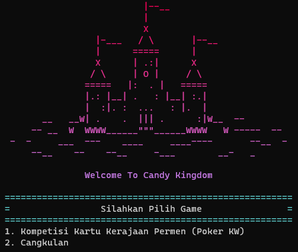

# IF2210_TB1_C0K

> IF2210 Object Oriented Programming Project 2022/2023

PESTA KERAJAAN PERMEN



## Deskripsi Singkat Program
Dalam rangka merayakan pesta panen gula di kerajaan permen, akan diadakan kompetisi massal permainan kartu ala Kerajaan Permen. Ratu kerajaan permen ingin mencari pemain kartu terhebat di kerajaannya. Namun karena Ratu tidak bisa memantau permainan satu-persatu, kalian diminta untuk membuatkan sistem agar permainan dapat berjalan dengan adil.

## Struktur Direktori
```
├───doc
├───src                     
│   ├───class
|   |   ├───ability
|   |   ├───cardValue
|   |   ├───exception
|   |   ├───game
|   |   └───inventoryHolder
│   ├───core
│   └───utility
└───tes
```

## Build
### 1. Requirement
Pastikan dependency berikut terpenuhi sebelum melakukan build program:
- CMake >= 3.6
- Make
- GNU C Compiler (untuk Windows, pastikan untuk memakai GCC dari MinGW)
### 2. Step
- Jalankan script `make compile`.
    ```
    make main
    ```
- Binary akan bernama `main` (atau `main.exe` pada Windows) setelah menjalankan script.

## Usage
- Jalankan script `make run`
    ```
    make run
    ```
- atau jalankan file `main` (atau `main.exe` pada Windows) setelah melakukan build.

- Mainkan permainan sesuai intruksi.

## Authors
Dibuat oleh Kelompok Anak Didikan Mama
- Muhammad Bangkit Dwi C.	13521055 
- Irsyad Nurwidianto Basuki	13521072 
- Bagas Aryo Seto    		13521081 
- Aulia Mey Diva Annandya	13521103 
- Muhammad Zaydan Athallah	13521104